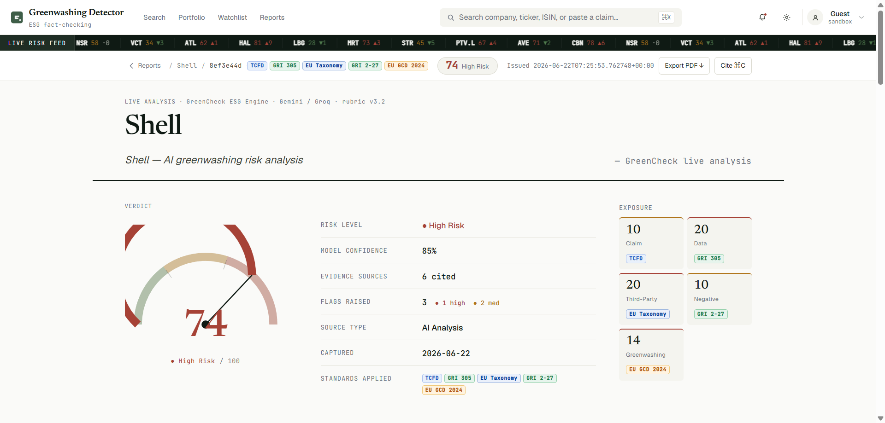
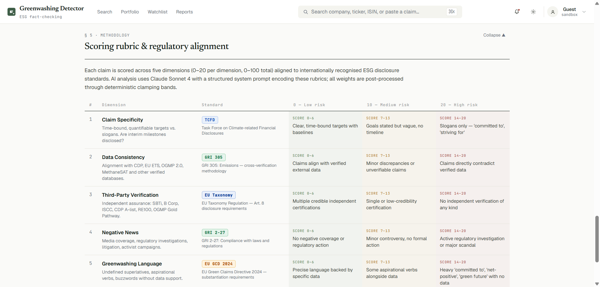
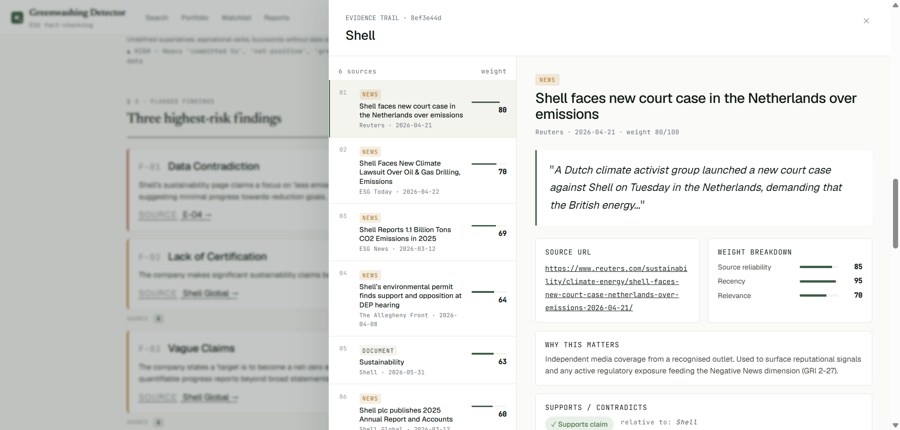

# GreenCheck


Corporate greenwashing is under increasing regulatory scrutiny. GreenCheck automates ESG claim verification — scrapes sustainability pages, cross-references against regulatory databases, and scores against five international standards including EU Green Claims Directive 2024.
Built as a general-purpose compliance scoring engine; ESG is the current config.

**Demo:** https://greenwashing-detector.vercel.app  
_(Backend on Railway, will hibernates on inactivity, cold start around 60s. Frontend and pre-cached companies work either way.)_





---

## Scoring dimensions

| Dimension | Standard |
|-----------|----------|
| Claim Specificity | TCFD |
| Data Consistency | GRI 305 |
| Third-Party Verification | EU Taxonomy Art. 8 |
| Negative News | GRI 2-27 |
| Greenwashing Language | EU GCD 2024 |

---

## How it works

### System Context


### Service Structure


### Request Flow


```
Browser
  → Frontend (React/Vite, Vercel)
  → web-service (FastAPI :8000, Railway)
  → analysis-service (FastAPI + Playwright :8080, Railway)
        scraper.py    Serper → ESG URL → Playwright → page text
        enricher.py   Serper News + Guardian → evidence objects
        analyzer.py   Gemini → Groq → Claude → local cache → mock
```

The scoring pipeline is domain-agnostic — ESG rubric and evidence weight bands are config. Evidence weighting: `weight = clamp_band(0.45 × reliability + 0.20 × recency + 0.35 × relevance)`. Reliability and recency are computed deterministically; AI only assigns relevance, bounded to a per-source-kind band.

AI fallback chain:
1. Gemini 2.5 Flash-Lite — 1,000/day free
2. Gemini 2.5 Flash — 250/day
3. Gemini 2.5 Pro — 100/day
4. Groq Llama 3.3 70B — 1,000/day, independent provider
5. Groq Llama 3.1 8B
6. Claude Sonnet 4 — optional paid layer
7. `local_cache.json` — pre-computed, zero network
8. generic mock

If Supabase is down, results still reach the user via an in-memory relay on the analysis service.

---

## Pre-cached companies

These five load instantly without any live API calls:

| Company | Score | Risk |
|---------|-------|------|
| Shell | 78 | High |
| H&M | 71 | High |
| BP | 74 | High |
| Tesla | 44 | Medium |
| Patagonia | 18 | Low |

Anything else triggers a live analysis (needs API keys + running backend).

---

## Setup

Requires Python 3.11+, Node 18+.

```bash
git clone https://github.com/kong-pd/greenwashing-detector.git
cd greenwashing-detector
cp .env.example .env
```

Minimum to get analysis running: `GEMINI_API_KEY`. Everything else has a fallback.

| Variable | Source |
|----------|--------|
| `GEMINI_API_KEY` | aistudio.google.com |
| `GROQ_API_KEY` | console.groq.com |
| `SERPER_API_KEY` | serper.dev |
| `GUARDIAN_API_KEY` | open-platform.theguardian.com |
| `ANTHROPIC_API_KEY` | console.anthropic.com |
| `SUPABASE_URL` + `SUPABASE_ANON_KEY` | supabase.com |
| `ANALYSIS_SERVICE_URL` | `http://localhost:8001` for local |

```bash
python -m venv venv && source venv/bin/activate
pip install -r requirements.txt
playwright install chromium

cd frontend && npm install
```

If using Supabase: run `database/schema.sql` in SQL Editor.

---

## Running locally

```bash
cd backend  && uvicorn main:app --reload --port 8000
cd analysis && uvicorn main:app --reload --port 8001
cd frontend && npm run dev   # → localhost:5173
```

---

## Testing

Three layers, all free of live API calls:

```bash
# Unit + integration
pytest backend/tests/ -v          # web-service: routes, normaliser, relay fallback
pytest analysis/tests/ -v         # pipeline, trace/stage contract, relevance gate
cd frontend && npm test           # vitest: API contracts, error copy

# AI evals (golden set, runs hermetically; add RUN_MODEL_EVALS=1 + real keys for score bands)
pytest analysis/evals/ -v
python -m evals.compare --label v3.2 [--against <old-label>]   # offline prompt regression

# Browser E2E (14 journeys, ~2min)
cd e2e && npm ci && npx playwright install chromium
npx playwright test
```

The E2E suite boots the real three-service topology (Chromium → Vite → web-service → analysis-service) and drives it like a user: search a cached company, hit a scraping failure, recover through manual input, open the evidence drawer. It is hermetic by construction — the same degradation ladder the app ships for resilience is what makes the tests deterministic: `USE_MOCK` short-circuits the AI chain, an empty Serper key makes the scraper fail with zero network, and pointing `SUPABASE_URL` at a closed local port forces every result through the NFR-09 in-memory relay. Every fallback layer asserted is a production feature, not test scaffolding. Runs in CI on every push (`.github/workflows/e2e.yml`), no secrets required.

---

## AI quality engineering

Every pipeline run writes an append-only **trace** (`{seq, span, type, level, name, data}`), emitted through a tiny stage contract (`analysis/tracing.py`). One log, three consumers: the loading screen renders the `level=user` projection live through the existing poll (every line on screen actually happened — including which fallback layer answered); the full JSONL lands in `analysis/traces/` as feedstock for the quality loop; fallback-layer hit rates and stage latencies fall out for free.

The quality loop: a **relevance gate** (`relevance.py`) refuses non-ESG content with `content_not_relevant` before any model spends a token — born from a real failure where a homework PDF received a confident greenwashing verdict. A **golden set** (`analysis/evals/golden/`, 23 cases: cached companies, clear greenwash/clean, non-ESG, edge, prompt-injection, multilingual) is executed as pytest, layered by what the environment can honestly verify: gate expectations always, result-shape property assertions on every run, score bands only with real keys. `evals/compare.py` diffs two snapshots for offline prompt regressions; `evals/flag.py` files bad traces into the failure corpus, whose house rule is that every diagnosed failure becomes a golden case. Prompts live in `analysis/prompts/` with the version recorded in every trace, result, and report masthead. Known gap, pinned by the golden set itself: ES/FR relevance stems.

---

## Things that will bite you

**Railway hibernation** — services freeze after ~30min inactivity. First request on a cold instance takes up to 60s. Nothing to do on the code side; just worth knowing before a demo.

**Playwright timeouts** — some sites block headless browsers or load slowly. Already using `domcontentloaded` + 3s wait instead of `networkidle`. Sites that still time out get the snippet-fallback path (search result excerpts instead of full page), and the report notes it. If even that fails, the frontend shows a manual paste UI.

**WeasyPrint on Ubuntu** — needs system libs that aren't in the default pip install:
```bash
sudo apt-get install -y libpango-1.0-0 libpangoft2-1.0-0 libharfbuzz-subset0
```

**Railway + Python version** — set `NIXPACKS_PYTHON_VERSION=3.11` in Railway variables or greenlet will resolve to an incompatible version and break the build.

---

## Deploy

Railway for both Python services, Vercel for frontend. Both auto-detect their config files.

Analysis service `Procfile`:
```
web: playwright install chromium; playwright install-deps chromium; uvicorn main:app --host 0.0.0.0 --port $PORT
```

Before deploying: update `allow_origins` in `backend/main.py` to include your Vercel URL.

Full walkthrough in `DEPLOYMENT.md`.

---

## Project layout

```
backend/
  routes/analyze.py     /api/analyze, /api/report, /api/history
  db/supabase.py        three-layer cache + DB ops + local fallback
  pdf/generator.py      WeasyPrint export

analysis/
  scraper.py            ESG page discovery + Playwright fetch
  enricher.py           news evidence assembly
  analyzer.py           AI chain + weight normalization
  local_cache.json      pre-computed results for five demo companies

frontend/src/
  screens/AnalysisScreen.jsx    polling state machine + manual input fallback
  screens/ReportScreen.jsx      five-section report + evidence drawer

analysis/
  tracing.py            trace/event log + stage contract (the spine)
  relevance.py          AI-1 gate — refuses non-ESG content before scoring
  prompts/              versioned prompt files (rubric v3.2)
  evals/                golden set · pytest runner · compare · failure corpus

e2e/
  playwright.config.js  boots all three services with a hermetic offline env
  tests/                14 browser journeys (cache hit, failure→recovery, live events, …)

database/
  schema.sql            fresh setup
  migration.sql         upgrade existing tables
```

---

## Contributing

`CONTRIBUTING.md`

## License

MIT
