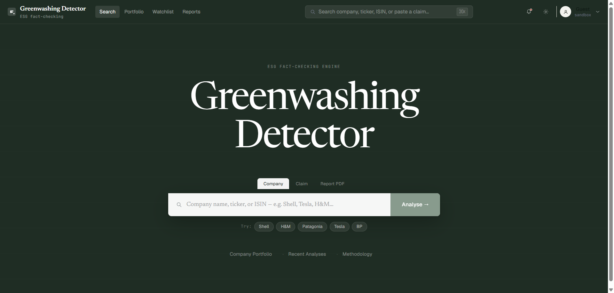
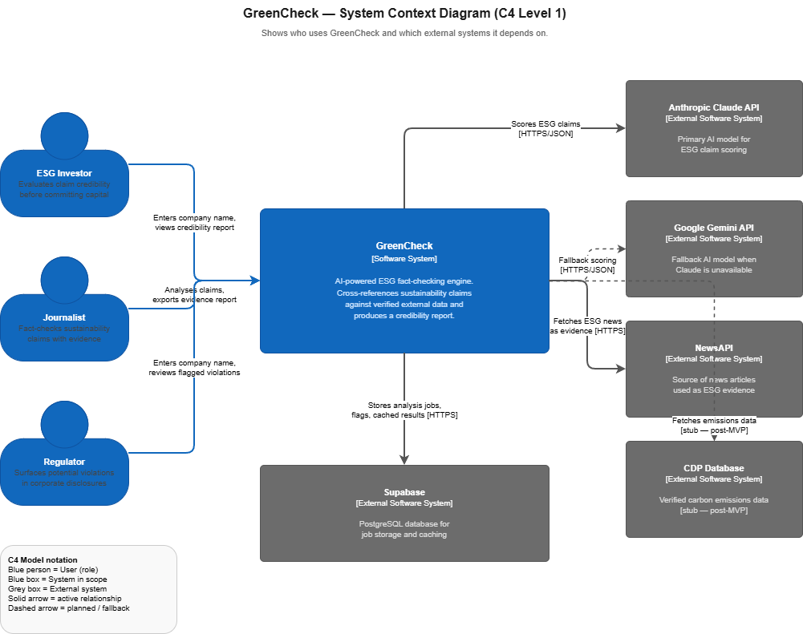
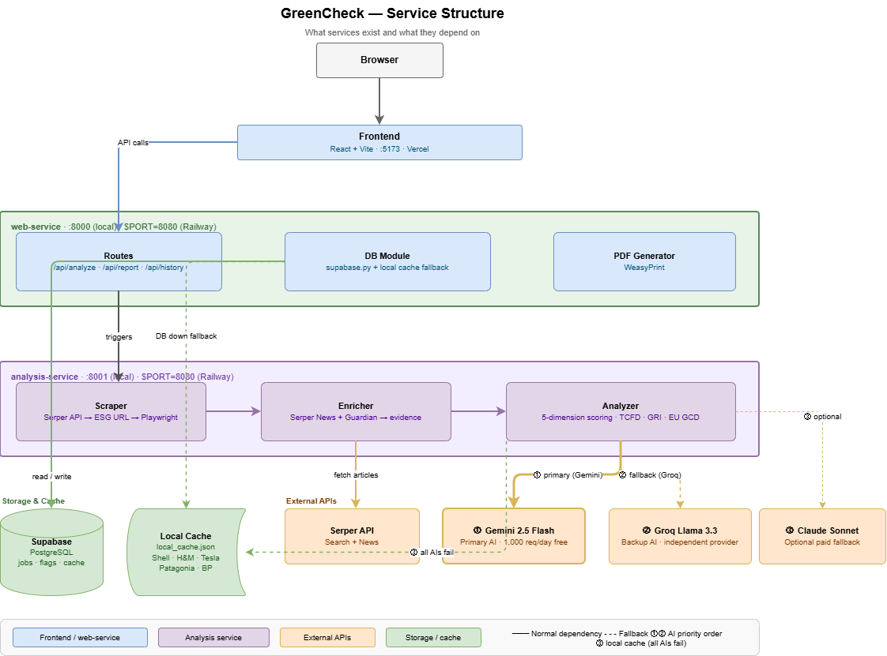
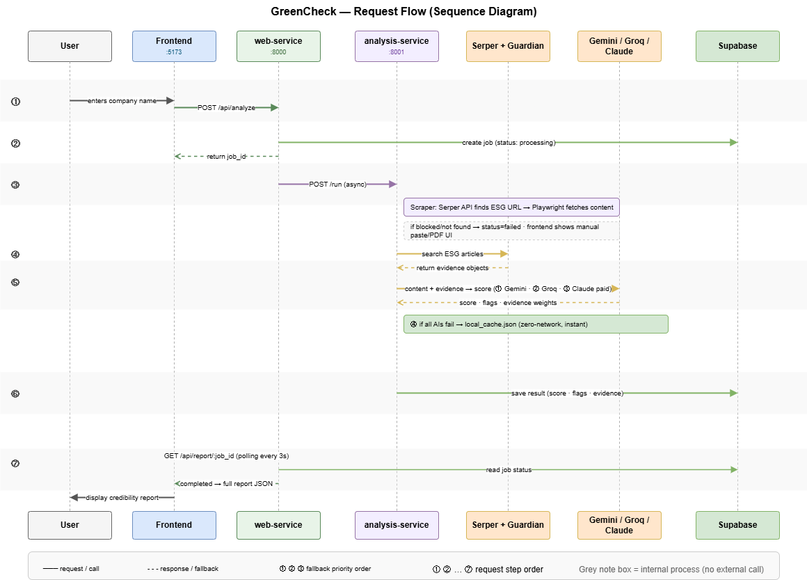

# GreenCheck — ESG Greenwashing Detector

> ImagineHack 2026 · A Sustainable Tomorrow · Taylor's University

An AI-powered ESG fact-checking engine that cross-references corporate sustainability claims against verified external data and produces a structured credibility report scored across five regulatory dimensions.

**Live demo:** https://greenwashing-detector.vercel.app



---

## What It Does

GreenCheck takes a company name, scrapes their ESG or sustainability page, enriches the result with external news evidence, and produces a 0–100 greenwashing risk score aligned to five international standards:

| Dimension | Standard |
|-----------|----------|
| Claim Specificity | TCFD |
| Data Consistency | GRI 305 |
| Third-Party Verification | EU Taxonomy Art. 8 |
| Negative News | GRI 2-27 |
| Greenwashing Language | EU Green Claims Directive 2024 |

The output includes a risk verdict (Low / Medium / High), flagged findings, weighted evidence sources, and an exportable PDF report.

---

## Architecture

GreenCheck runs as three independent services:

```
Browser
  └── Frontend  (React + Vite → Vercel)
        └── web-service  (FastAPI :8000 → Railway)
              └── analysis-service  (FastAPI + Playwright :8080 → Railway)
                    ├── scraper.py     Playwright + Serper API → ESG page content
                    ├── enricher.py    Serper News + Guardian → evidence objects
                    └── analyzer.py    Gemini → Groq → Claude → local cache → mock
```

```
Frontend          https://greenwashing-detector.vercel.app
web-service       https://greenwashing-detector-production.up.railway.app
analysis-service  https://humble-determination-production-4c4f.up.railway.app
```

### System Context



### Service Structure



### Request Flow



### AI Fallback Chain

The analyzer tries each provider in order until one succeeds:

1. Gemini 2.5 Flash-Lite (primary, 1,000 req/day free)
2. Gemini 2.5 Flash (backup, 250 req/day free)
3. Gemini 2.5 Pro (backup, 100 req/day free)
4. Groq Llama 3.3 70B (independent provider, 1,000 req/day free)
5. Groq Llama 3.1 8B (lighter Groq backup)
6. Claude Sonnet 4 (optional paid fallback)
7. Local cache (pre-computed results for demo companies)
8. Generic mock (absolute last resort)

If scraping is blocked (Shell, BP, etc.), the frontend shows a manual paste / PDF upload fallback instead of failing silently.

---

## Prerequisites

| Tool | Version |
|------|---------|
| Python | 3.11+ |
| Node.js | 18+ |
| Git | Any |

---

## Local Setup

### 1. Clone

```bash
git clone https://github.com/kong-pd/greenwashing-detector.git
cd greenwashing-detector
```

### 2. Environment variables

```bash
cp .env.example .env
```

Fill in `.env`:

| Variable | Description | Where to get it |
|----------|-------------|----------------|
| `SUPABASE_URL` | Supabase project URL | Supabase → Settings → API |
| `SUPABASE_ANON_KEY` | Supabase publishable key | Supabase → Settings → API |
| `GEMINI_API_KEY` | Gemini API key (primary AI) | [aistudio.google.com](https://aistudio.google.com) |
| `GROQ_API_KEY` | Groq API key (backup AI) | [console.groq.com](https://console.groq.com) |
| `ANTHROPIC_API_KEY` | Claude API key (optional paid fallback) | [console.anthropic.com](https://console.anthropic.com) |
| `SERPER_API_KEY` | Serper API key (web search + news) | [serper.dev](https://serper.dev) |
| `GUARDIAN_API_KEY` | Guardian API key (news supplement) | [open-platform.theguardian.com](https://open-platform.theguardian.com) |
| `ANALYSIS_SERVICE_URL` | URL of the analysis service | `http://localhost:8001` (local) |
| `USE_MOCK` | Emergency fallback mode | `false` normally; `true` bypasses all APIs |
| `CACHE_TTL_HOURS` | How long to cache completed analyses | `48` recommended for demo |

### 3. Database

Open your Supabase project → SQL Editor → paste `database/schema.sql` → Run.

If upgrading an existing project, run `database/migration.sql` instead.

### 4. Python dependencies

```bash
python -m venv venv
source venv/bin/activate      # macOS/Linux
# .\venv\Scripts\activate     # Windows

pip install -r requirements.txt
playwright install chromium
```

### 5. Frontend dependencies

```bash
cd frontend
npm install
cd ..
```

---

## Running Locally

Three terminals required:

```bash
# Terminal 1 — Backend (web-service)
cd backend
uvicorn main:app --reload --port 8000

# Terminal 2 — Analysis service
cd analysis
uvicorn main:app --reload --port 8001

# Terminal 3 — Frontend
cd frontend
npm run dev
```

Open **http://localhost:5173**.

---

## Project Structure

```
greenwashing-detector/
│
├── backend/                    # web-service (FastAPI, port 8000)
│   ├── main.py
│   ├── routes/analyze.py       # /api/analyze, /api/report, /api/history
│   ├── db/supabase.py          # DB operations with local cache fallback
│   └── pdf/generator.py        # PDF export (WeasyPrint)
│
├── analysis/                   # analysis-service (FastAPI, port 8001)
│   ├── main.py                 # Pipeline orchestrator
│   ├── scraper.py              # Serper → ESG URL → Playwright → content
│   ├── enricher.py             # Serper News + Guardian → evidence objects
│   ├── analyzer.py             # Gemini → Groq → Claude → cache → mock chain
│   └── local_cache.json        # Pre-computed results: Shell, H&M, Patagonia, Tesla, BP
│
├── frontend/                   # React + Vite (port 5173)
│   └── src/
│       ├── App.jsx             # Main shell and routing
│       ├── screens/
│       │   ├── AnalysisScreen.jsx
│       │   └── ReportScreen.jsx
│       ├── components/         # SharedComponents, TweaksPanel, Interactions
│       └── api/client.js
│
├── database/
│   ├── schema.sql              # Fresh Supabase setup
│   └── migration.sql           # Upgrade existing tables (adds dimension_scores, severity)
│
├── docs/                       # draw.io architecture diagrams
│   ├── greencheck-c4-context.drawio
│   ├── greencheck-sequence.drawio
│   └── greencheck-structure.drawio
│
└── .env.example
```

---

## Deployment

### Railway (Backend + Analysis)

1. New Project → Deploy from GitHub → root directory: `backend` (or `analysis`)
2. Railway auto-detects the `Procfile`
3. Add environment variables under Settings → Variables
4. The analysis service Procfile installs Playwright at startup:
   ```
   web: playwright install chromium; playwright install-deps chromium; uvicorn main:app --host 0.0.0.0 --port $PORT
   ```

Set `NIXPACKS_PYTHON_VERSION=3.11` in Railway variables to avoid greenlet compatibility issues.

### Vercel (Frontend)

1. New Project → Import repo → root directory: `frontend`
2. No environment variables needed — API calls proxy through `vercel.json` to the Railway backend URL

See `DEPLOYMENT.md` for full step-by-step instructions.

---

## Fault Tolerance

| Scenario | What Happens |
|----------|-------------|
| Scraper blocked by anti-bot | Frontend shows manual paste / PDF upload fallback |
| Gemini quota exhausted | Auto-switches to Groq |
| Both AIs unavailable | Falls back to local_cache.json (no network needed) |
| Company not in local cache | Returns generic mock report |
| Supabase unavailable | Reads from local cache; writes skipped gracefully |
| All APIs down | Set `USE_MOCK=true` in `.env` for guaranteed demo output |

---

## Demo Companies

These five companies are pre-cached in `analysis/local_cache.json` for instant, zero-API demo results:

| Company | Score | Risk |
|---------|-------|------|
| Shell | 78 | High Risk |
| H&M | 71 | High Risk |
| BP | 74 | High Risk |
| Tesla | 44 | Medium Risk |
| Patagonia | 18 | Low Risk |

Any other company triggers a live analysis (requires API keys).

---

## Health Checks

```bash
curl https://greenwashing-detector-production.up.railway.app/health
# → {"status":"ok"}

curl https://humble-determination-production-4c4f.up.railway.app/health
# → {"status":"ok","service":"analysis"}
```

---

## Common Issues

| Problem | Cause | Fix |
|---------|-------|-----|
| `uvicorn` not found | venv not activated | `source venv/bin/activate` |
| Analysis always fails | API keys missing or wrong | Check `.env` values |
| Playwright timeout | `networkidle` on large sites | Already fixed — uses `domcontentloaded` |
| Railway build fails on greenlet | Wrong Python version | Set `NIXPACKS_PYTHON_VERSION=3.11` |
| Frontend shows 404 | Backend CORS not set | Add Vercel URL to `allow_origins` in `backend/main.py` |

---

## Contributing

See `CONTRIBUTING.md` for branch naming conventions, commit message format, PR guidelines, and the emergency merge procedure for demo day.

---

## License

MIT — see `LICENSE`.
